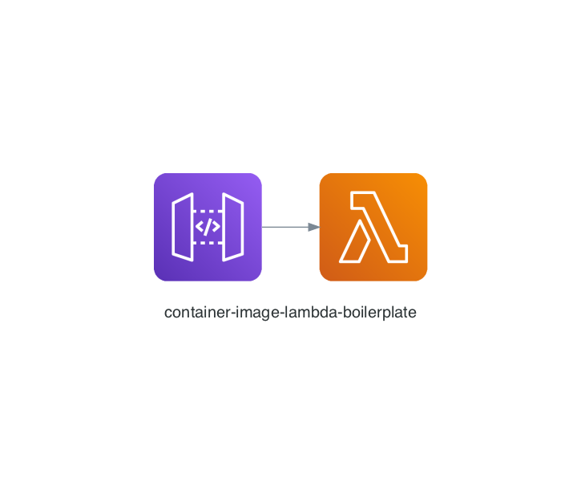

# Deploy Python Lambda functions with container images.



Build docker image lambda function wtih API Gateway. Just define a function and build your image you want.


# 👋 Prerequisite
- Install `awscli`: [Official Document for installation](https://docs.aws.amazon.com/cli/latest/userguide/cli-chap-install.html)

- Install `direnv`
    ```bash
    # Install `direnv` (macOS)
    brew install direnv

    ## Append to `~/.zshrc`
    eval "$(direnv hook zsh)"
    ```

- Fill `envrc`
- Relaunch your shell.
    ```bash
    # Relaunch your shell.
    # Check the variables with the command as below.
    printenv | grep <VARIABLE-NAME>
    ```

# 🎮 How to deploy 
```bash
# Login ECR.
./scripts/00-login-ecr.sh

# Build image and push to Amazon ECR.
./scripts/01-create-ecr-repository.sh
./scripts/02-ecr-tag-and-push.sh

# Create and deploy lambda function.
./scripts/03-create-iam-for-lambda.sh
./scripts/04-deploy-to-lambda.sh

# Provision API Gateway.
./scripts/05-create-api-gateway.py
```

# 🦿 Update your function.
```bash
# after fix code at './lambda'
./scripts/10-update-function.sh
```

# Customize boilerplate 
- Policy generator : https://awspolicygen.s3.amazonaws.com/policygen.html


# Reference
- https://docs.aws.amazon.com/lambda/latest/dg/python-image.html
- https://awscli.amazonaws.com/v2/documentation/api/latest/reference/ecr/get-login-password.html